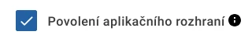

=================================================
Endpointy pro přístup k editačním webovým službám
=================================================

API editačních služeb je dostupné protokolem HTTPS. Komunikace probíhá v režimu „request-response“ ve formátu XML (nikoli však SOAP). Aplikace zasílá POST „request“ s požadovanou metodou na příslušný endpoint editační služby, služba pak odpovídá pomocí „response“, anebo v případě neúspěchu :ref:`„error response“<ws:errors>`. Zaslané požadavky musejí být autentizovány.

.. contents::
   :local:
   :depth: 1

Verze 1.1 webových služeb se od verze 1.0 liší rozdílným jmenným prostorem XML, způsobem autentizace (*mTLS* oproti *basic HTTP authentication*) a adresou endpointů.

Endpointy pro přístup k WS 1.0
==============================

.. _ws10:endpoints:

.. list-table:: Endpointy API editačních webových služeb 1.0
   :header-rows: 1

   * - Prostředí
     - Adresa
   * - integrační
     - https://externaleditapi10.caais-test-ext.gov.cz/spravadat/ws/call/exampleId
   * - školicí
     - https://externaleditapi10.caais-edu.gov.cz/spravadat/ws/call/exampleId   
   * - produkční
     - https://externaleditapi10.caais.gov.cz/spravadat/ws/call/exampleId
     
Pokud jste připojeni do :abbr:`CMS (Centrální místo služeb)`, použijete místo domény **gov.cz** doménu **cms2.cz**.

Hodnota parametru ``exampleId`` obsahuje zkratku subjektu z CAAIS.

.. admonition:: Formát URL
   :class: warning
   
   Na rozdíl od endpointů JIP/KAAS nekončí endpointy CAAIS lomítkem.

Nastavení subjektu v CAAIS
--------------------------

Subjekt musí mít dovoleno použití aplikačního rozhraní – záložka *Ostatní* na detailu subjektu v CAAIS GUI, jinak volání služby selže.

Autentizace
-----------

Aplikace třetí strany musí službu volat s *basic HTTP authentication*, tzn. zadáním uživatelského jména a hesla *lokálního administrátora* [#pswd_conf]_. Systém CAAIS pak aplikaci třetí strany povolí přístup dle definovaných přístupových práv k danému subjektu. Pro zabezpečení komunikace je dovoleno používat pouze šifrování protokolem TLS 1.2 nebo TLS 1.3, ostatní verze (SSL, TLS 1.0, TLS 1.1) nejsou povoleny.

.. [#pswd_conf] V rámci rozvoje CAAIS 2026–2027 bude CAAIS upraven tak, aby bylo místo hesla lokálního administrátora použito dedikované heslo, respektive token.

.. admonition:: Příklad volání endpointu
   :class: info
   
   .. literalinclude:: _static/sh/getversion.ws10.sh
      :language: zsh

      
Endpointy pro přístup k WS 1.1
==============================

Podle kategorie volané metody je nutné zvolit jeden ze tří endpointů.

Kategorie metod editačních služeb
---------------------------------

Každou metodu editační služby je nutné volat na správném endpointu podle kategorie, do které spadá:

- :ref:`ws-edit/1<ws:edit-1>` – čtení a zápis údajů daného subjektu (odpovídá webové službě verze 1.0)
  
  - čtení a správa dat vlastního subjektu
  - čtení a správa dat podřízených subjektů, které přenesly působnost lokálního administrátora na daný subjekt

- :ref:`ws-edit/2<ws:edit-2>` – specializované metody pro daný subjekt
  
  - ztotožnění osoby v :abbr:`ROB (Registr obyvatel)` (přiřazení :abbr:`AIFO (Agendový Identifikátor Fyzické Osoby)` k uživateli)
  - načtení seznamu podřízených subjektů, které přenesly působnost lokálního administrátora nebo čtení dat subjektu na daný subjekt
  - načtení historie změn dat za definované období

- :ref:`ws-edit/3<ws:edit-3>` – čtení dat pro daný subjekt (odpovídající read-only metodám ws-edit/1)
  
  - čtení dat vlastního subjektu
  - čtení dat podřízených subjektů, které přenesly působnost čtení dat subjektu na daný subjekt

.. _ws11:endpoints:

.. list-table:: Endpointy API editačních webových služeb 1.1
   :header-rows: 1

   * - Prostředí
     - Adresa
   * - integrační
     - https://cert-externaleditapi11.caais-test-ext.gov.cz/spravadat/ws-edit/1/call/exampleId
     
       https://cert-externaleditapi11.caais-test-ext.gov.cz/spravadat/ws-edit/2/call/exampleId
     
       https://cert-externaleditapi11.caais-test-ext.gov.cz/spravadat/ws-edit/3/call/exampleId
   * - školicí
     - https://cert-externaleditapi11.caais-edu.gov.cz/spravadat/ws-edit/1/call/exampleId
       
       https://cert-externaleditapi11.caais-edu.gov.cz/spravadat/ws-edit/2/call/exampleId
       
       https://cert-externaleditapi11.caais-edu.gov.cz/spravadat/ws-edit/3/call/exampleId
   * - produkční
     - https://cert-externaleditapi11.caais.gov.cz/spravadat/ws-edit/1/call/exampleId
       
       https://cert-externaleditapi11.caais.gov.cz/spravadat/ws-edit/2/call/exampleId
       
       https://cert-externaleditapi11.caais.gov.cz/spravadat/ws-edit/3/call/exampleId
     
Pokud jste připojeni do :abbr:`CMS (Centrální místo služeb)`, použijete místo domény **gov.cz** doménu **cms2.cz**.

Hodnota parametru ``exampleId`` obsahuje zkratku subjektu z CAAIS.

.. admonition:: Formát URL
   :class: warning
   
   Na rozdíl od endpointů JIP/KAAS nekončí endpointy CAAIS lomítkem.

Nastavení subjektu v CAAIS
--------------------------

Subjekt musí mít dovoleno použití aplikačního rozhraní – záložka *Ostatní* na detailu subjektu v CAAIS GUI, jinak volání služeb selže.

Autentizace
-----------

Aplikace třetí strany musí službu volat s mTLS autentizací, tzn. s použitím klientského x509 certifikátu [#client_cert]_. Certifikát je nutné nejprve registrovat v CAAIS pod konfigurací libovolného AIS pod daným subjektem [#idm_conf]_. Certifikát musí být vydán :ref:`podporovanou certifikační autoritou <si:ca>`. Pro zabezpečení komunikace je dovoleno používat pouze šifrování protokolem TLS 1.2 nebo TLS 1.3, ostatní verze (SSL, TLS 1.0, TLS 1.1) nejsou povoleny.

.. [#client_cert] = certifikát v atributu X509v3 Extended Key Usage dovoluje TLS Web Client Authentication
.. [#idm_conf] V rámci rozvoje CAAIS 2026–2027 bude CAAIS upraven tak, aby bylo možné použít jen certifikáty registrované v konfiguracích explicitně určených pro volání editačních webových služeb.

.. admonition:: Příklad volání endpointu
   :class: info
   
   .. literalinclude:: _static/sh/getversion.ws11.sh
      :language: zsh

