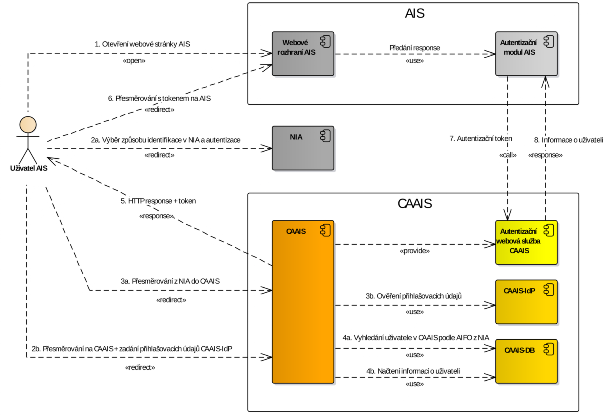
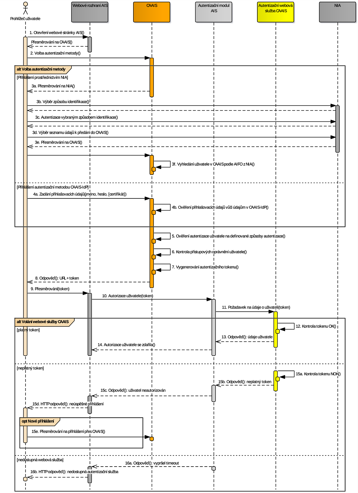
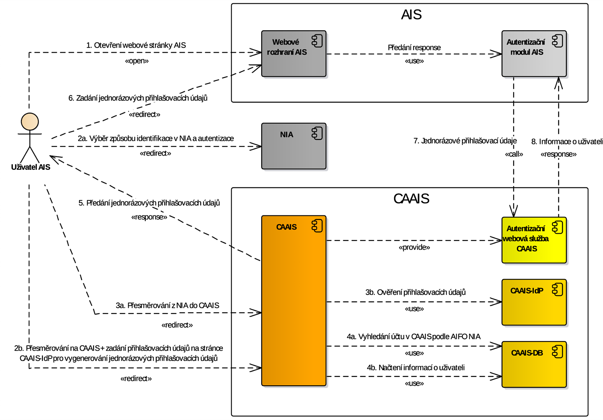
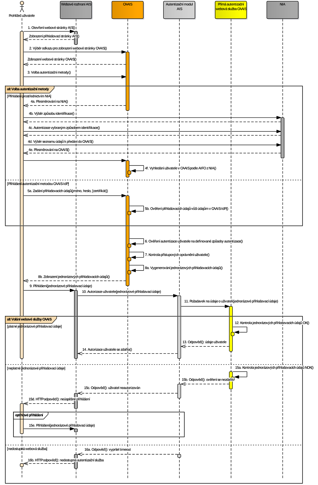
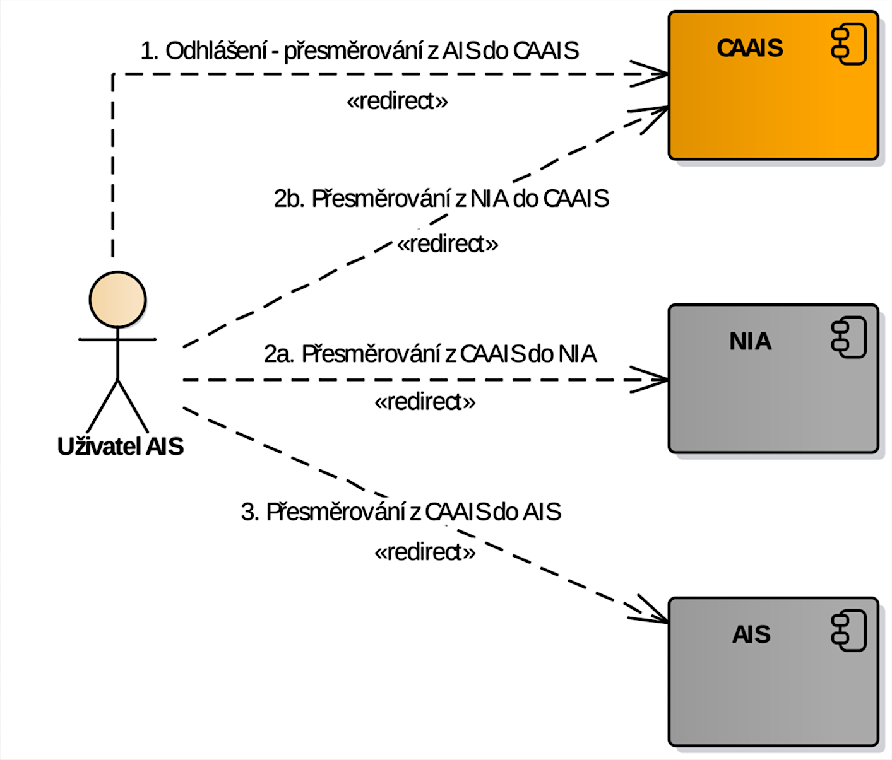
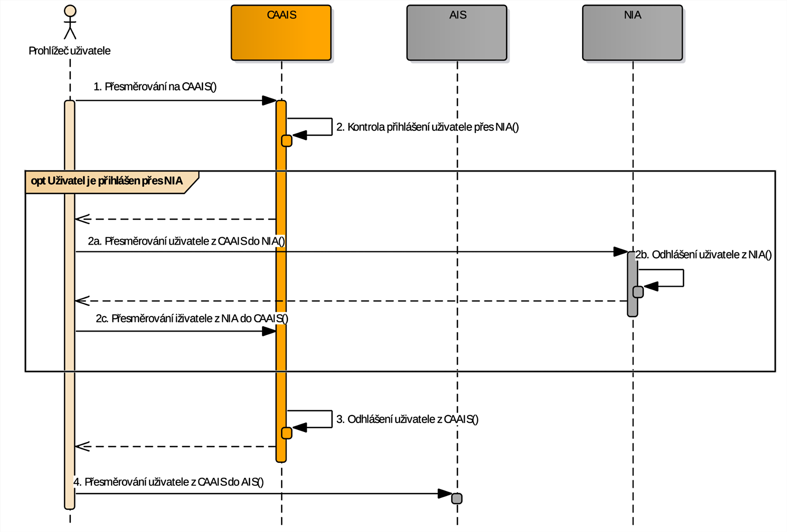

======================================================
Proces přihlášení a odhlášení pomocí JIP/KAAS (legacy)
======================================================

Autentizační služby JIP/KAAS
============================

Typy autentizačních služeb
--------------------------

V systému CAAIS jsou implementovány následující typy autentizačních služeb:

(Klasická) autentizační webová služba CAAIS
  Neautentizované uživatele musí AIS nejdříve přesměrovat na přihlašovací stránku CAAIS, kde se následně po úspěšném ověření uživatele v další komunikaci předává autentizační token. Přesměrování z AIS do CAAIS a zpět je zde plně automatické.

Přímá autentizační webová služba CAAIS
  Pro neautentizované uživatele musí AIS nabízet odkaz na speciální přihlašovací stránku CAAIS, kde se následně po úspěšném ověření uživatele pro další komunikaci vygenerují jednorázové přihlašovací údaje (jméno + heslo), které musí uživatel ručně zadat do přihlašovací stránky AIS. V tomto případě není přesměrování z AIS do CAAIS a zpět automatické.
    
V obou případech tyto služby poskytují systémům AIS ověření uživatele buď přihlašovacími údaji pro modul CAAIS-IdP nebo pomocí NIA. Obě služby vracejí stejnou množinu údajů o uživateli a subjektu, ve kterém je uživatel zařazen, liší se v jednotlivých krocích procesu autentizace a v požadovaných vstupních údajích předávaných v žádostech.

Autentizace požadavku AIS vůči CAAIS
------------------------------------

AIS při volání autentizačních služeb používá svůj klientský certifikát pro navázání mTLS spojení. Tento certifikát musí být zaregistrován v konfiguraci AIS v CAAIS a musí být vydán podporovanou certifikační autoritou (podrobnosti v části :ref:`si:certs`).

.. admonition:: Jednoznačná identifikace AIS pomocí certifikátu
   :class: note

   Certifikát je používán nejen k autentizaci AIS, nýbrž i k *jednoznačné identifikaci* konfigurace AIS v CAAIS. Certifikát tak musí být registrován jako autentizační právě u jedné konfigurace AIS, jinak ověření AIS selže.

Autentizační webová služba (klasická)
=====================================

AIS musí pro využívání tohoto typu služby na jedné straně implementovat podporu přesměrování neautentizovaných uživatelů do CAAIS a na straně druhé poskytnout webovou stránku pro akceptaci ověřeného uživatele z CAAIS.

Diagram procesu autentizace a autorizace
----------------------------------------

   Diagram autentizace uživatele klasickou autentizační webovou službou protokolem JIP/KAAS (legacy).

1. Uživatel otevře webovou stránku AIS. Pokud systém AIS zjistí, že není uživatel přihlášen, je přesměrován na webovou stránku CAAIS, kde si uživatel zvolí způsob přihlášení.

*Varianta (a)* Uživatel si vybral přihlášení prostřednictvím NIA:
   
2. Uživatel je přesměrován do NIA, kde si zvolí identifikační prostředek, pomocí něhož se ověří jeho identita a uživatel pak vybere údaje, které o něm mohou být předány do CAAIS.
#. Uživatel je pak přesměrován zpátky do CAAIS spolu s vybranými osobními údaji.
#. Z těchto údajů si systém CAAIS vytáhne atribut AIFO, pomocí kterého se pokusí vyhledat odpovídající uživatelský účet (profil) v CAAIS. Pokud je těchto účtu nalezeno více, uživatel si vybere ten, pod nímž se chce do AIS přihlásit.   

*Varianta (b)* Uživatel si vybral přihlášení pomocí autentizačních metod v CAAIS-IdP:

2. Uživatel vyplní své přihlašovací údaje.
#. V systému CAAIS-IdP se ověří jejich správnost.
#. Po úspěšné autentizaci systém CAAIS načte ze své DB informace o uživateli, subjektu (OVM/SPUÚ), ke kterému je přiřazen, a přidělených rolích.

*Společné oběma variantám:*

5. Systém CAAIS ověří, že autentizační metoda vybraná uživatelem splňuje úroveň LoA, která je pro daný AIS nakonfigurována v CAAIS. Dále se v CAAIS na základě přístupových rolí přidělených uživateli ověří, zda je oprávněn přistoupit do AIS. Pokud ano, vygeneruje se v CAAIS pro uživatele autentizační token s omezenou dobou platnosti. Jinak se uživateli zobrazí hláška o zamítnutí přístupu. 
#. Uživatel je přesměrován s tímto tokenem na definovanou adresu AIS (v konfiguraci AIS).
#. Autentizační modul AIS pak zavolá autentizační webovou službu CAAIS spolu s autentizačním tokenem pro načtení informací o uživateli.
#. Pokud systém CAAIS zjistí, že je token platný, předá zpět do AIS požadované informace o uživateli. Pokud je volaná správná verze služby, CAAIS v odpovědi předá osobní údaje uživatele. Podle získaných údajů pak AIS rozhodne, zda umožní/neumožní přistup uživateli do AIS. Pokud je token neplatný, vrací se z CAAIS do AIS chybový kód.

Sekvenční diagram komunikace a předávání dat
--------------------------------------------

   Sekvenční diagram autentizace uživatele klasickou autentizační webovou službou protokolem JIP/KAAS (legacy).

1. Uživatel se pokusí otevřít webovou stránku AIS. Pokud systém AIS zjistí, že uživatel již nemá aktivní session, přesměruje uživatele na CAAIS.
2. Na přihlašovací stránce CAAIS si uživatel zvolí způsob přihlášení.

*Varianta (a)* Uživatel si vybral přihlášení prostřednictvím NIA:

- 3a. Přesměrování uživatele do NIA.
- 3b. Uživatel zde vybere identifikační prostředek, kterým chce prokázat svoji identitu.
- 3c. Pomocí tohoto identifikačního prostředku se provede v NIA autentizace.
- 3d. Uživatel vybere údaje, které o něm mohou být předány do CAAIS.
- 3e. Přesměrování uživatele zpátky do CAAIS i s jeho údaji.
- 3f. Systém CAAIS dle AIFO z těchto údajů nalezne ve své DB odpovídající uživatelské účty (profily) a pokračuje se dále na krok 5).

*Varianta (b)* Uživatel si vybral přihlášení pomocí autentizačních metod v CAAIS-IdP:

- 4a. Uživatel vyplní své přihlašovací údaje na přihlašovací stránce CAAIS-IdP.
- 4b. V systému CAAIS-IdP se ověří správnost těchto údajů. 

*Společné oběma variantám:*

5. V CAAIS se provede kontrola autentizační metody, kterou vybral uživatel, zda splňuje úroveň LoA, která je pro daný AIS nakonfigurována v CAAIS.
#. V CAAIS se provede kontrola, že uživatel má dostatečná oprávnění pro přístup do AIS.
#. V CAAIS se vygeneruje autentizační token pro uživatele.
#. Do webového prohlížeče uživatele odešle systém CAAIS HTTP response s příslušným autentizačním tokenem a informací, že má být přesměrován na definovanou adresu AIS.
#. Uživatel je spolu s autentizačním tokenem přesměrován na tuto adresu AIS.
#. Autentizační modul AIS se pokusí autentizovat přistupujícího uživatele (kroky 11–16)
#. Autentizační modul AIS provolá synchronní autentizační službu CAAIS pro získání údajů uživatele. Parametrem volání je autentizační token.
#. V CAAIS se provede kontrola tokenu.
#. Pokud je token platný, předají se údaje uživatele do AIS a zneplatní se session uživatele.
#. Uživatel je pro daný AIS autorizován a má oprávnění pracovat s AIS.

*Získaní údajů o uživateli z CAAIS může být neúspěšné z následujících příčin:*

15. Pokud je token neplatný, vrací autentizační služba tuto chybu a AIS ji prezentuje hláškou o neúspěšném přihlášení.
#. Pokud je autentizační služba nedostupná, prezentuje to AIS jako hlášku "nedostupná autentizační služba".

Přímá autentizační webová služba
================================

AIS musí pro využívání tohoto typu služby zobrazovat na přihlašovací stránce odkaz na speciální přihlašovací stránku CAAIS pro vygenerování jednorázových přihlašovacích údajů.

Diagram procesu autentizace a autorizace
----------------------------------------

   Diagram autentizace uživatele přímou autentizační webovou službou protokolem JIP/KAAS (legacy).

   
1. Uživatel otevře webovou stránku AIS, kde klikne na odkaz a přejde na speciální stránku CAAIS, kde se generují jednorázové přihlašovací údaje. Zde si uživatel zvolí způsob přihlášení.

*Varianta (a)* Uživatel si vybral přihlášení prostřednictvím NIA:

2. Uživatel je přesměrován do NIA, kde si zvolí identifikační prostředek, pomocí něhož se ověří jeho identita a uživatel pak vybere údaje, které o něm mohou být předány do CAAIS.
#. Uživatel je pak přesměrován zpátky do CAAIS spolu s vybranými osobními údaji.
#. Z těchto údajů si systém CAAIS vytáhne atribut AIFO, pomocí kterého se pokusí vyhledat odpovídající uživatelský účet (profil) v CAAIS. Pokud je těchto účtu nalezeno více, uživatel si vybere ten, pod nímž se chce do AIS přihlásit.

*Varianta (b)* Uživatel si vybral přihlášení pomocí autentizačních metod v CAAIS-IdP:

2. Uživatel vyplní své přihlašovací údaje.
#. V systému CAAIS-IdP se ověří jejich správnost.
#. Po úspěšné autentizaci systém CAAIS načte ze své DB informace o uživateli, subjektu (OVM/SPUÚ), ke kterému je přiřazen, a přidělených rolích.

*Společné oběma variantám:*

5. Systém CAAIS ověří, že autentizační metoda vybraná uživatelem splňuje úroveň LoA, která je pro daný AIS nakonfigurována v CAAIS. Dále se v CAAIS na základě přístupových rolí přidělených uživateli ověří, zda je oprávněn přistoupit do AIS. Pokud ano, vygeneruje se v CAAIS jednorázové uživatelské jméno a heslo s omezenou dobou platnosti a zobrazí se uživateli. Jinak se uživateli zobrazí hláška o zamítnutí přístupu.
#. Uživatel tyto jednorázové údaje přepíše do přihlašovací stránky AIS a potvrdí přihlášení.
#. Autentizační modul AIS pak zavolá přímou autentizační webovou službu CAAIS spolu s jednorázovými přihlašovacími údaji pro načtení informací o uživateli.

#. Pokud systém CAAIS zjistí, že jsou jednorázové přihlašovací údaje platné, předá zpět do AIS požadované informace o uživateli. Pokud je volaná správná verze služby, CAAIS v odpovědi předá osobní údaje uživatele. Podle získaných údajů pak AIS rozhodne, zda umožní/neumožní přístup uživateli do AIS. Pokud jsou jednorázové přihlašovací údaje neplatné, vrací se z CAAIS do AIS chybový kód.

Sekvenční diagram komunikace a předávání dat
--------------------------------------------

   Sekvenční diagram autentizace uživatele přímou autentizační webovou službou protokolem JIP/KAAS (legacy).

   
#. Uživatel si otevře přihlašovací stránku AIS. 
#. Na přihlašovací stránce AIS klikne na odkaz a přejde na speciální stránku CAAIS, kde se generují jednorázové přihlašovací údaje. 
#. Na přihlašovací stránce CAAIS si uživatel zvolí způsob přihlášení.
    
*Varianta (a)* Uživatel si vybral přihlášení prostřednictvím NIA:

- 4a. Přesměrování uživatele do NIA.
- 4b. Uživatel zde vybere identifikační prostředek, kterým chce prokázat svoji identitu.
- 4c. Pomocí tohoto identifikačního prostředku se provede v NIA autentizace.
- 4d. Uživatel vybere údaje, které o něm mohou být předány do CAAIS.
- 4e. Přesměrování uživatele zpátky do CAAIS i s jeho údaji.
- 4f. Systém CAAIS dle AIFO z těchto údajů nalezne ve své DB odpovídající uživatelské účty (profily) a pokračuje se dále na krok 6).

*Varianta (b)* Uživatel si vybral přihlášení pomocí autentizačních metod v CAAIS-IdP:

- 5a. Uživatel vyplní své přihlašovací údaje na přihlašovací stránce CAAIS-IdP.
- 5b. V systému CAAIS-IdP se ověří správnost těchto údajů.
    
*Společné oběma variantám:*

6. V CAAIS se provede kontrola autentizační metody, kterou vybral uživatel, zda splňuje úroveň LoA, která je pro daný AIS nakonfigurována v CAAIS.
#. V CAAIS se provede kontrola, že uživatel má dostatečná oprávnění pro přístup do AIS.
#. V CAAIS se vygenerují jednorázové přihlašovací údaje s omezenou dobou platnosti a zobrazí se uživateli.
#. Uživatel tyto jednorázové přihlašovací údaje přepíše do přihlašovací stránky AIS a potvrdí přihlášení.
#. Autentizační modul AIS se pokusí autentizovat přistupujícího uživatele (kroky 11-16)
#. Autentizační modul AIS provolá synchronní autentizační službu CAAIS pro získání údajů uživatele. Parametrem volání jsou také ty jednorázové přihlašovací údaje zadané uživatelem.
#. V CAAIS se provede kontrola správnosti jednorázových přihlašovacích údajů.
#. Pokud jsou jednorázové přihlašovací údaje správné, předají se údaje uživatele do AIS a tyto jednorázové přihlašovací údaje se zneplatní.
#. Uživatel je pro daný AIS autorizován a má oprávnění pracovat s AIS.

*Získaní údajů o uživateli z CAAIS může být neúspěšné z následujících příčin:*

15. Pokud jsou jednorázové přihlašovací údaje neplatné, vrací autentizační služba tuto chybu a AIS ji prezentuje hláškou o neúspěšném přihlášení.
#. Pokud je autentizační služba nedostupná, prezentuje to AIS jako hlášku "nedostupná autentizační služba"

Webová služba pro odhlášení uživatele
=====================================

V případě, že uživatel provádí odhlášení v systému AIS (např. tlačítkem „Odhlásit se“ nebo odkazem pro odhlášení), měl by systém AIS po ukončení sezení uživatele na své straně z bezpečnostních důvodů volat rozhraní pro odhlášení poskytované systémem CAAIS. Pokud byl uživatel přihlášen přes NIA, systém CAAIS zařídí odhlášení i z tohoto systému.

Diagram procesu odhlášení
-------------------------

   Diagram odhlášení uživatele protokolem JIP/KAAS (legacy).

1. Uživatel v AIS zvolí odhlášení a následně je přesměrován do CAAIS. Systém CAAIS zjistí, jakým způsobem byl uživatel přihlášen.

*Varianta (a)* Uživatel byl přihlášen prostřednictvím NIA:

- 2a. Uživatel je přesměrován do NIA, kde se provede odhlášení.
- 2b. Uživatel je přesměrován do NIA, kde se provede odhlášení.

*Varianta (b)* Uživatel byl přihlášen pomocí autentizačních metod v CAAIS-IdP:

*Společné oběma variantám:*

3. Uživatel je odhlášen z CAAIS a přesměrován zpět na odhlašovací adresu AIS definovánou konfigurací AIS v CAAIS

Sekvenční diagram komunikace a předávání dat
--------------------------------------------

   Sekvenční diagram odhlášení uživatele protokolem JIP/KAAS (legacy).

1. Uživatel v AIS zvolí odhlášení a následně je přesměrován do CAAIS. Systém CAAIS zjistí, jakým způsobem byl uživatel přihlášen.

*Varianta (a)* Uživatel byl přihlášen prostřednictvím NIA:

- 2a. Uživatel je přesměrován do NIA.
- 2b. Uživatel je odhlášen z NIA
- 2c. Uživatel je přesměrován zpět do CAAIS.

*Varianta (b)* Uživatel byl přihlášen pomocí autentizačních metod v CAAIS-IdP:

*Společné oběma variantám:*

3. Uživatel je odhlášen z CAAIS.
#. Uživatel je přesměrován zpět na odhlašovací adresu AIS.
