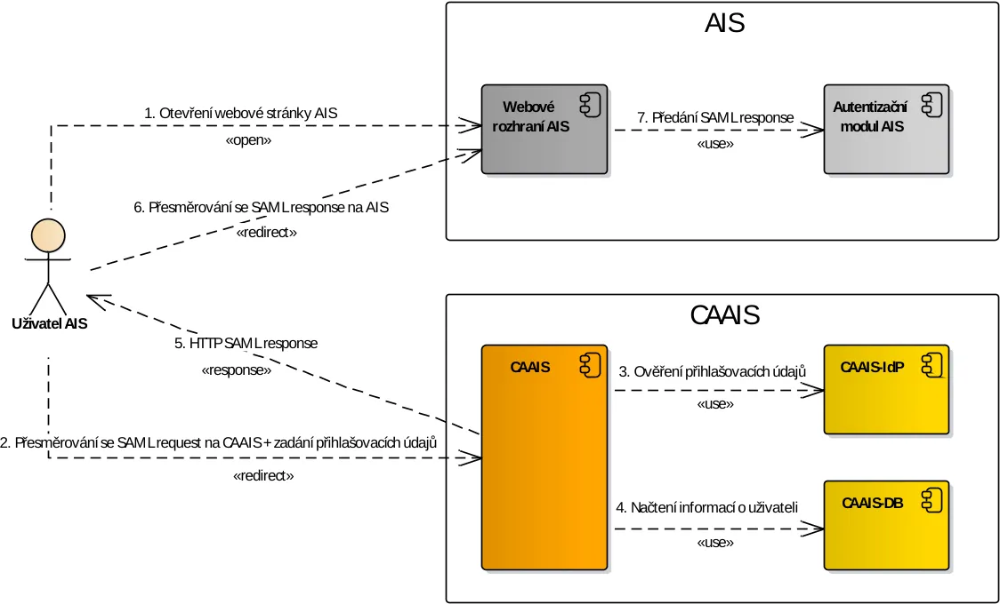

==================================
Proces autentizace pomocí SAML 2.0
==================================

Proces autentizace uživatele, otevírajícího si stránku AIS pomocí protokolu SAML 2.0 skrze CAAIS, je popsán v následující části.

V SAML jsou definovány 3 základní role účastnící se komunikace:

    - principal = uživatel
    - service provider = v našem případě AIS
    - identity provider = v našem případě CAAIS-IdP

   Diagram autentizace uživatele protokolem OIDC.

1. Uživatel otevře webovou stránku AIS

#. Pokud systém AIS zjistí, že není uživatel přihlášen, vygeneruje SAML request a uživatel je přesměrován na webovou stránku CAAIS se zakódovaným SAML requestem (viz kapitola :ref:`api_saml:login_url`). Na této přihlašovací stránce CAAIS si uživatel zvolí způsob přihlášení a zadá přihlašovací údaje.

#. Systém CAAIS ověří, že autentizační metoda vybraná uživatelem splňuje úroveň LoA, která je pro daný AIS nakonfigurována v CAAIS. Provádí-li se autentizace pomocí interního CAAIS-IdP, komponenta CAAIS-IdP ještě navíc ověří správnost zadaných přihlašovacích údajů uživatele vůči uloženým údajům.

#. Pokud je autentizace úspěšná, provede CAAIS načtení informací o uživateli ze své databáze. Následně se v CAAIS na základě přístupových rolí přidělených uživateli ověří, zda je oprávněn přistoupit do AIS. Pokud ano, pokračuje se dalším krokem. Jinak se uživateli zobrazí hláška o zamítnutí přístupu.
   
#. CAAIS vygeneruje zakódovanou SAML response.

#. A uživatel je s touto odpovědí přesměrován na definovanou adresu AIS (viz kapitola :ref:`api_saml:response_url`). Případné návratové URL v obdrženém SAML requestu jsou ignorovány.

#. V systému AIS se zpracuje SAML response, ze kterého se vyčtou informace o uživateli a na základě nich se umožní/neumožní přístup uživateli do AIS.

Předpoklady pro SAML autentizaci
================================

Pro používání SAML autentizace platí podobné předpoklady, jako pro klasickou/přímou autentizační webovou službu CAAIS (viz dokument „CAAIS: Autentizační webová služba - Procesní popis“).

.. _api_saml:predpoklady:konfigurace:

Registrace a konfigurace AIS v CAAIS
------------------------------------

AIS musí být v systému CAAIS nejdříve zaregistrován pod definovaný subjekt, což se provádí na základě elektronického formuláře, který zástupce AIS odesílá na definovanou datovou schránku.

U takto registrovaného AIS následně provede lokální administrátor subjektu konfiguraci těchto primárních údajů:

    - Povolená návratová URL pro SAML a OIDC – seznam návratových adres AIS, kam je uživatel přesměrován po autentizaci
    - Podepisovací certifikát – tímto certifikátem AIS podepisuje SAML request (více viz kapitola :ref:`api_saml:predpoklady:certifikaty`).
    - Šifrovací certifikát – CAAIS používá tento certifikát k zašifrování SAML response. 

.. _api_saml:predpoklady:certifikaty:
    
Certifikáty
-----------

Podepisovací certifikát používá AIS pro podepisování SAML requestu.

Pomocí šifrovacího certifikátu pak AIS šifruje SAML response. Z bezpečnostních důvodů CAAIS nepoužívá pro zašifrování podepisovací certifikát obsažený v SAML requestu, ale právě šifrovací certifikát přiložený v konfiguraci AIS v CAAIS.

Oba certifikáty musí být typu komerční serverový, musí být zaregistrovány v nastavení AIS (viz kapitola :ref:`api_saml:predpoklady:konfigurace`) a musí být vydané podporovanou certifikační autoritou:

    - I.CA
    - PostSignum
    - eIdentity
    - NCA

V konfiguraci AIS v CAAIS může být zaregistrován vždy jen jeden podepisovací a jeden šifrovací certifikát. Je však možné použít stejný certifikát pro oba tyto typy certifikátů.

Přístupové role pro AIS
-----------------------

V systému CAAIS je možné jednotlivým AIS definovat přístupové role, které pak daný AIS využívá pro řízení přístupu uživatelů. Nejdříve se číselník těchto přístupových rolí vytvoří u AIS a pak se tyto role přidělí konkrétním subjektům, které mají mít přístup do tohoto AIS. Lokální administrátoři těchto subjektů pak tyto přístupové role přidělují jednotlivým uživatelům daného subjektu.

Pokud nemá AIS žádné takové přístupové role vytvořeny, povolí systém CAAIS přístup do takového AIS všem uživatelům z libovolného subjektu. Za nastavení těchto rolí je tedy zodpovědný AIS.
