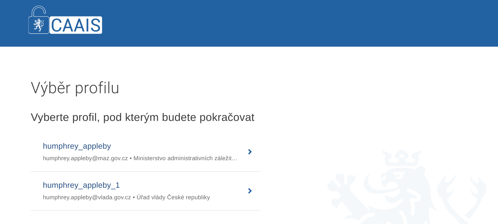
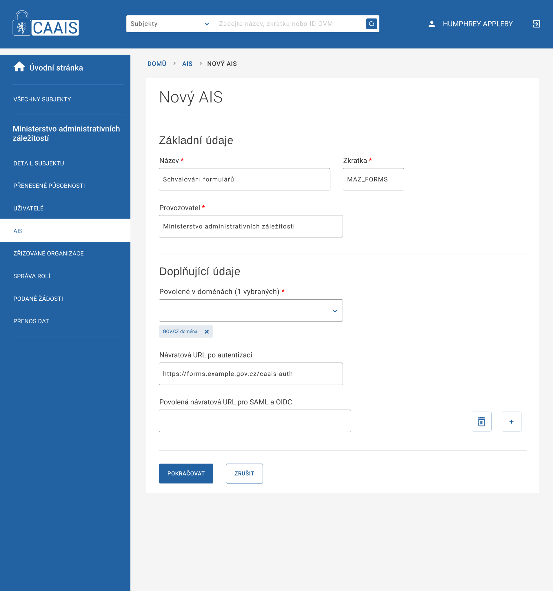
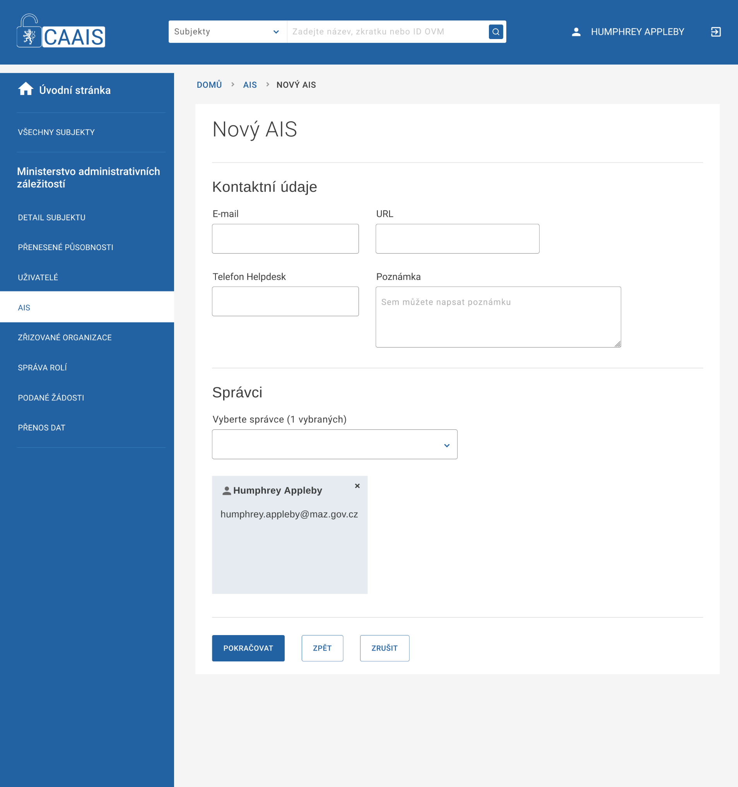
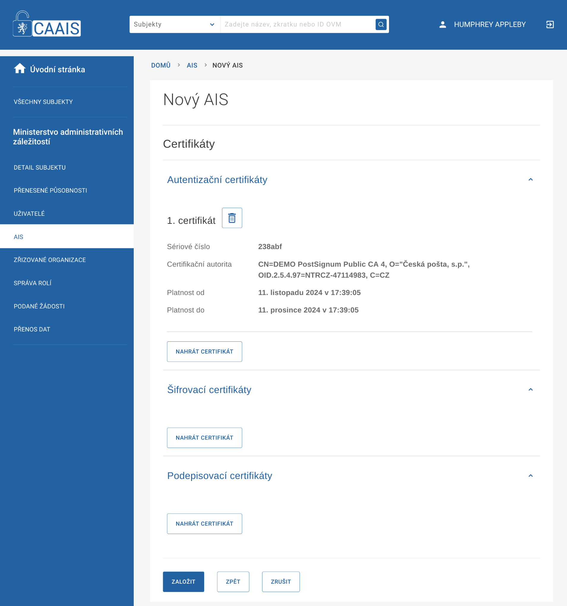
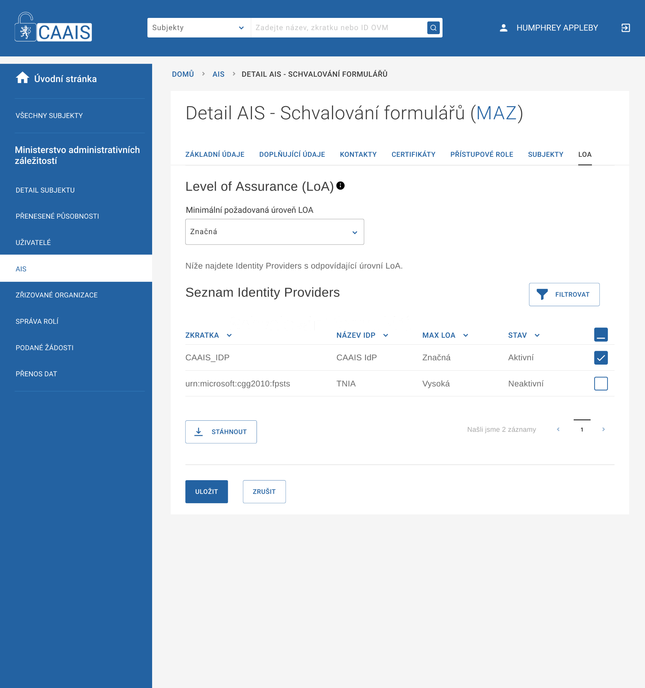
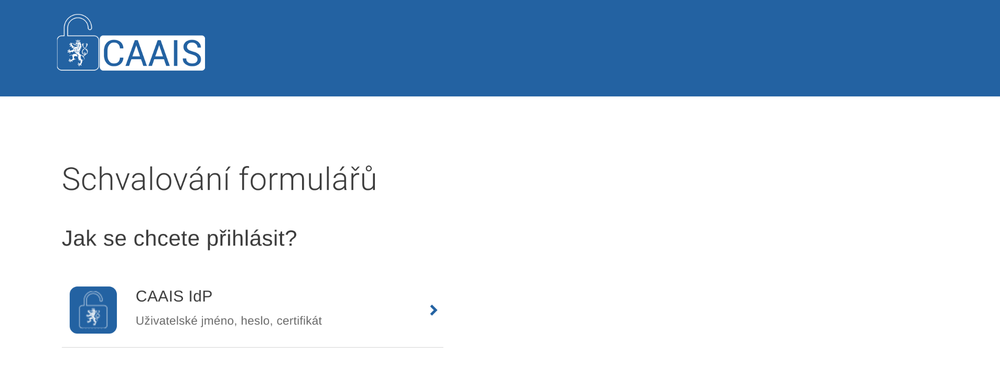

.. _tutorial_jip:

=================================================
Testovací konfigurace CAAIS s JIP/KAAS protokolem
=================================================

.. include:: authentization-certificate.inc.rst

Založení AIS
============

Pro založení minimálního AIS jsou potřeba tyto údaje:

    - název a unikátní kód (zkratka)
    - subjekt správce
    - návratová URL 
    - autentizační certifikát
    
V našem příkladu vytváříme aplikaci pro schvalování formulářů spravovanou Ministerstvem administrativních záležitostí, jehož lokální administrátorem je Humphrey Appleby.

Přihlášení
----------

Přihlásíte se to systému jako Humphrey Appleby a vybereme jeho profil na Ministerstvu administrativních záležitostí.

Základní údaje
--------------

Na záložce AIS klepneme na přidat nový AIS (+AIS). Vyplníme základní údaje.

**Zkratka** je jedinečný kód (identifikátor) AIS v CAAIS. Důrazně doporučujeme volit pouze *bezpečné ASCII znaky* bez mezery a jiných bílých znaků.

Jako **povolenou doménu** zvolíme *gov.cz*.

Návratovou URL po autentizaci necháme prázdnou – slouží pouze pro AIS využívající legacy protokol JIP/KAAS. **Návratovou URL po autentizaci** vyplníme dle vlastní aplikace – na tuto adresu je uživatel po autentizaci přesměrován spolu s tokenem (*sessionId*) přihlášení.

Správce konfigurace AIS
-----------------------

V dalším kroku přiřadíme AIS **správce**. Může jím být jakýkoli uživatel provozovatele. Pro jednoduchost volíme sami sebe. Po založení má správce pravomoc dokončit nastavení AIS.

   
Autentizační certifikát
-----------------------

V dalším kroku do systému nahrajeme veřejnou část certifikátu pro autentizaci, jak jsme ji obdrželi od (testovací) certifikační autority. AIS může od CAAIS vyžadovat ověření přihlášení a údaje o uživateli jen tehdy, naváže-li TLS spojení s některým svým registrovaným certifikátem, jinak je spojení odmítnuto.

.. admonition:: Certifikát musí být unikátní
   :class: warning

   Stejný certifikát nesmí být použit jako autentizační u jiné konfiguraci AIS na daném prostředí CAAIS.

   
Výběr Identity Providera
------------------------

Po založení AIS musíme ještě bezpodmínečně vybrat alespoň jednu službu, proti které budeme uživatele ověřovat. Na záložce **LoA** vybereme *CAAIS_IDP*, neb ta jediná je na testovacím prostředí aktivní a změnu nastavení uložíme.

Otestování konfigurace
----------------------
   
Nyní můžeme úspěšné založení AIS v CAAIS otestovat. Na adrese `https://externalauthapi.caais-test-ext.gov.cz/login?atsId=MAZ_FORMS`, kde místo `MAZ_FORMS` uvedete kód vlastního AIS, by se měla zobrazit přihlašovací stránka včetně CAAIS-IdP jako zdroje pro ověření uživatele.

.. include:: role.inc.rst 

Kam dál?
========

Další podrobnosti jsou uvedeny v dokumentaci pro vývojáře :ref:`api_jip`.
