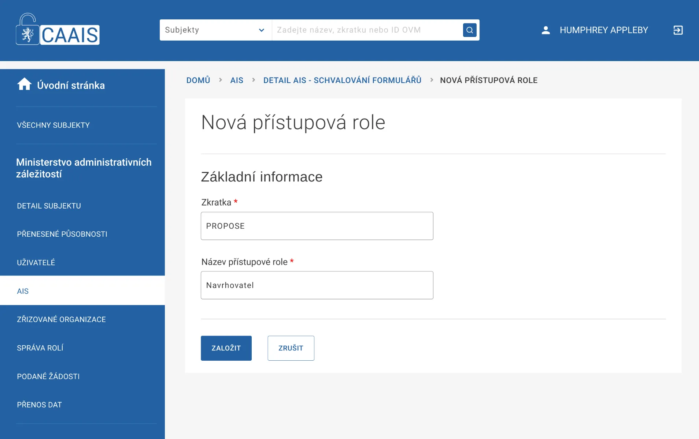
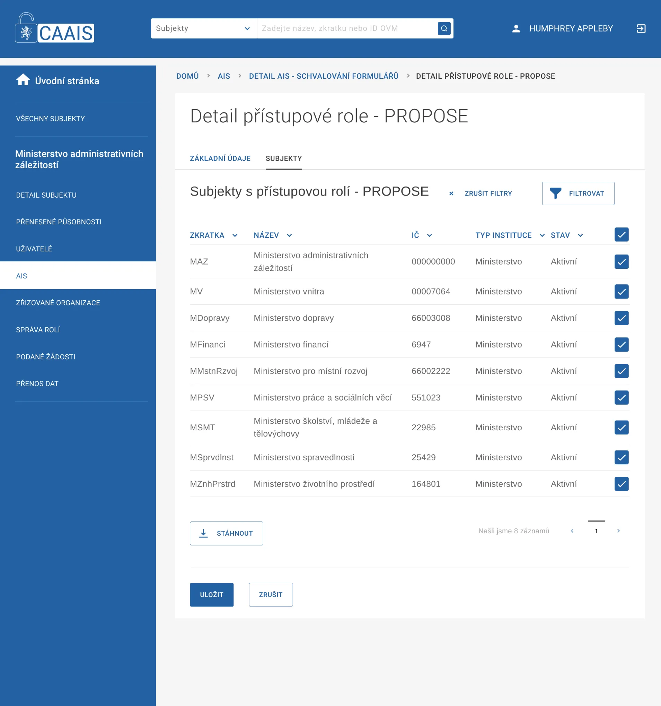
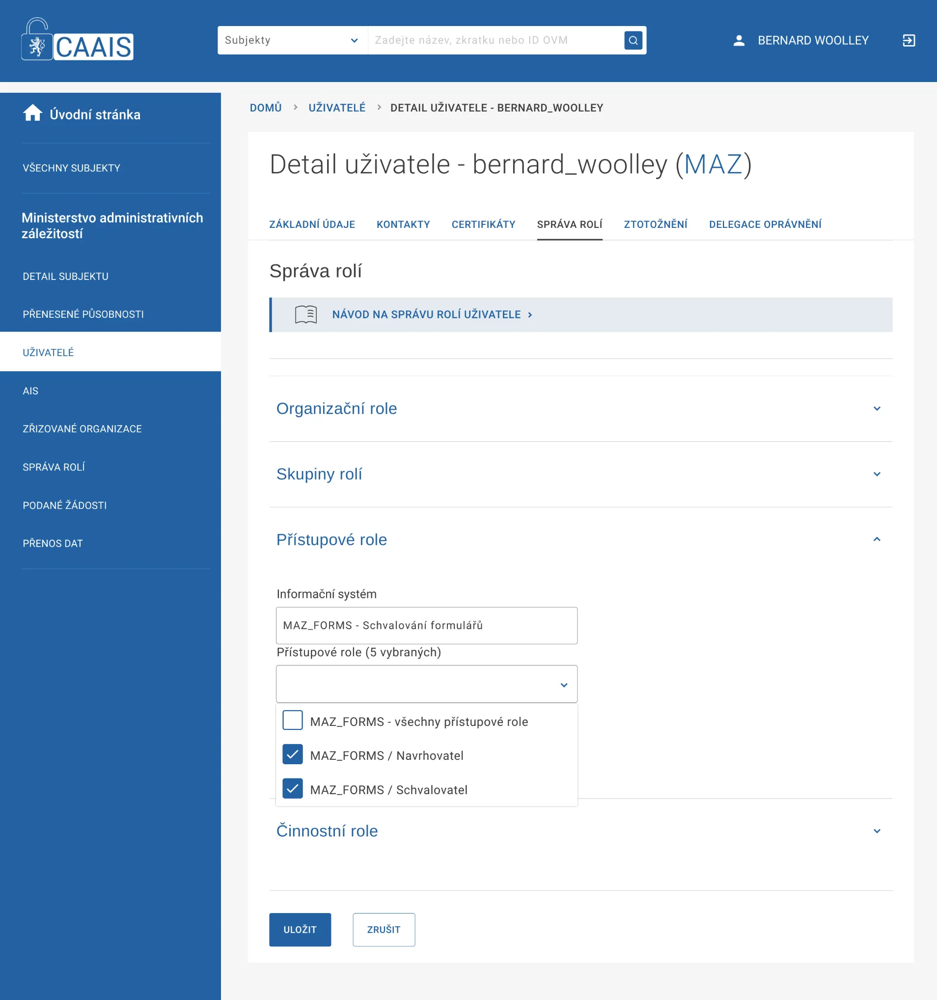

Založení rolí AIS
=================

V AIS vybereme záložku Přístupové role a zvolíme přidat přístupovou roli (+ Přístupová role). **Zkratka** je jedinečný kód (identifikátor) v rámci AIS. Pokud má váš AIS velké množství rolí, můžete použít například tečkovou notaci v kódu k vytvoření jejich hierarchie. **Název** by pak měl být plně srozumitelný pro lokální administrátory na jednotlivých subjektech (úřadech), které budou role uživatelům přidělovat. V našem příkladu vytvoříme role Navrhovatele a Schvalovatele.

   
Přiřazení rolí subjektům
------------------------

Dalším krokem je přiřazení subjektů, které mohou tyto role svým uživatelům přidělovat. Děje se tak z detailu role. S výhodou můžeme v tomto kroku použít filtraci. Roli navrhovatele umožníme přiřazovat všem ministerstvům, zatímco roli schvalovatele ponecháme na Ministerstvu pro administrativní záležitosti.

Přiřazení rolí uživatelům
=========================

Pro dokončení nastavení prostředí testovacího scénáře ještě musíme roli přidělit konkrétním uživatelům. Přihlásíme se do CAAIS jako lokální administrátor subjektu, kterému jsme svěřili v předchozím kroku pravomoc ty které role přiřazovat. Lokálním administrátorem na Ministerstvu pro administrativní záležitosti, který se stará o správu uživatelů, je Bernard Woolley.
Po přihlášení vybere z menu uživatelů spadajícím pod jeho subjekt – Ministerstvo pro administrativní záležitosti – konkrétního uživatele, kterému chce role svěřit. Pro jednoduchost vybírá sám sebe a na záložce správa rolí si přiřazuje přístupovou roli Navrhovatele a Schvalovatele.

