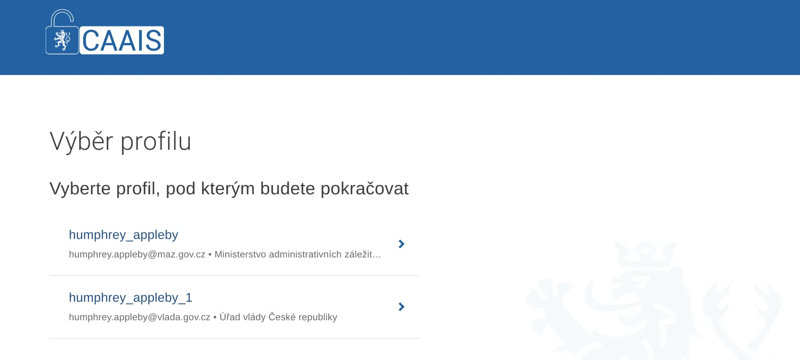
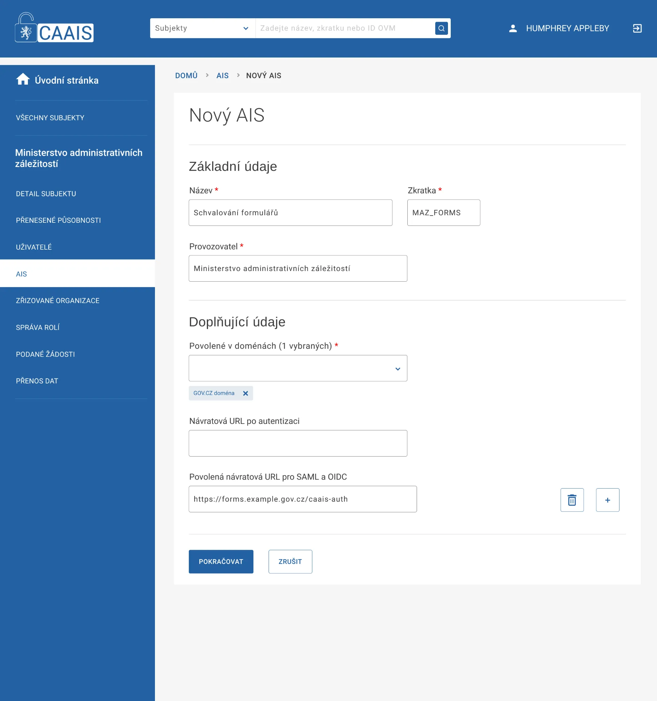
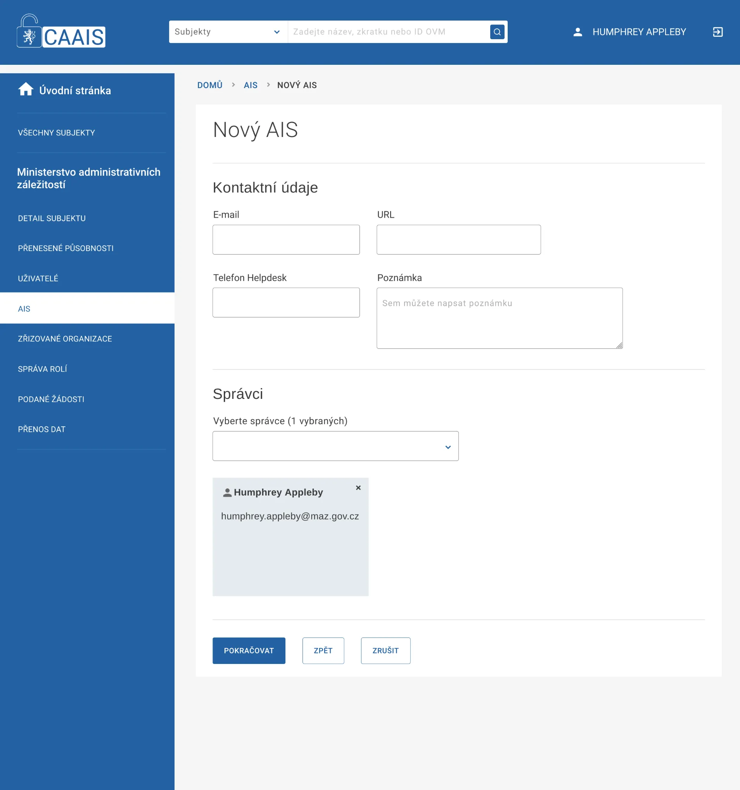
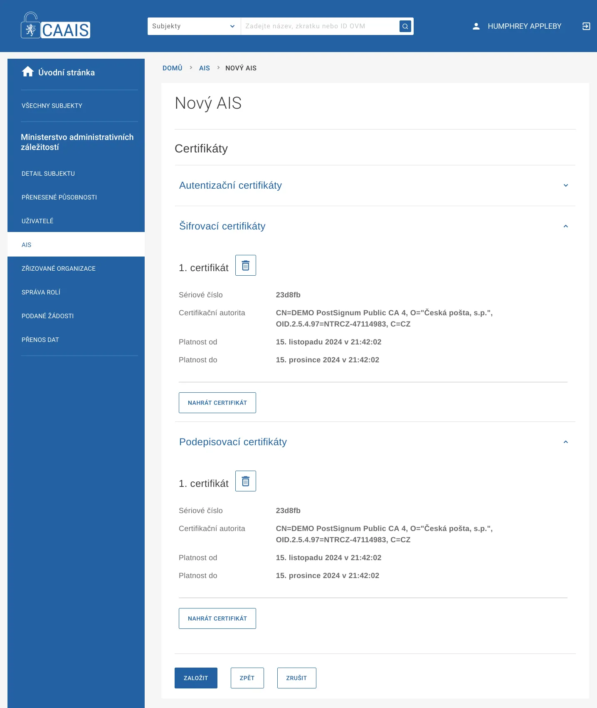
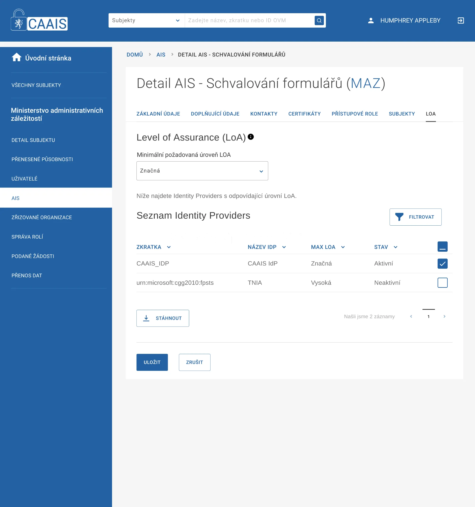

.. _tutorial_saml:

==================================================
Testovací konfigurace CAAIS se SAML 2.0 protokolem
==================================================

Příprava: Vygenerování podpisového a šifrovacího certifikátu AIS
================================================================

Nejjednodušší cesta je poslat nám žádost o certifikát (certificate signing request) jako soubor csr. Alternativně můžete použít komerční certifikát stejného typu jako na produkčním prostředí, anebo testovací certifikát týchž certifikačních autorit (nabízí se zejména PostSignum).

Vytvoření CSR pomocí `openssl`
------------------------------

Nejprve vygenerujte privátní klíč. Můžete využít algoritmus RSA (1a) o délce klíče 2048, 3072 či 4096 bitů, anebo ECDSA (1b) o délce klíče 256, 383 či 521 bitů. 

.. code:: bash

  (1a) $ openssl genrsa -out key.pem 2048
  (1b) $ openssl genpkey -algorithm ec -pkeyopt ec_paramgen_curve:P-256 -out key.pem

Následně vygenerujte (2) žádost o vystavení certifikátu (CSR soubor):

.. code:: bash

  (2)  $ openssl req -new -key key.pem -out server.csr \
           -subj "/C=CZ/O=Ministerstvo administrativních záležitostí/CN=forms.example.gov.cz"

Hodnotu parametru `-subj` upravte podle svého (testovacího) AIS; `CN` by mělo odpovídat plně kvalifikovanému doménovému jménu (FQDN) serveru AIS, se kterým bude testovací prostředí CAAIS komunikovat, nebo zkratce AIS, pod kterou je veden v CAAIS. Zkontrolujte vytvořenou žádost (3).  

.. code:: bash

  (3)  $ openssl req -text -noout -in server.csr | grep Subject:

Soubor `server.csr` nám pošlete, abychom vám mohli vytvořit testovací certifikát. Alternativně jej můžete použít k získání (testovacího) certifikátu od komerční certifikační autority.

Pokud chcete odlišný certifikát (klíč) pro šifrování, celý postup zopakujte.

Alternativa: Testovací certifikát od PostSignum
-----------------------------------------------

Žádost o certifikát (CSR soubor) nahrajte na `stránkách PostSignum <https://www.postsignum.cz/testovaci_certifikat.html>`_. Vyberte možnost *Komerční serverový certifikát (VCA)*. Vyplňte *název certifikátu*, například jako zkratku AIS či jako plně kvalifikované doménové jméno (FQDN) serveru AIS, se kterým bude testovací prostředí CAAIS komunikovat. V našem příkladu `forms.example.gov.cz`. Dále vyplňte *e-mail*, kam bude následně odkaz ke stažení testovacího certifikátu doručen a formulář odešlete.

Poznámka: Generování certifikátu PostSignum pro ECDSA klíče aktuálně (listopad 2024) selhává.

Založení AIS
============

Pro založení minimálního AIS jsou potřeba tyto údaje:

    - název a unikátní kód (zkratka)
    - subjekt správce
    - návratová URL pro SAML 
    - podpisový a šifrovací certifikát (může být shodný)
    
V našem příkladu vytváříme aplikaci pro schvalování formulářů spravovanou Ministerstvem administrativních záležitostí, jehož lokální administrátorem je Humphrey Appleby.

Přihlášení
----------

Přihlásíte se to systému jako Humphrey Appleby a vybereme jeho profil na Ministerstvu administrativních záležitostí.

Základní údaje
--------------

Na záložce AIS klepneme na přidat nový AIS (+AIS). Vyplníme základní údaje.

**Zkratka** je jedinečný kód (identifikátor) AIS v CAAIS. Důrazně doporučujeme volit pouze *bezpečné ASCII znaky* bez mezery a jiných bílých znaků.

Jako **povolenou doménu** zvolíme *gov.cz*.

Návratovou URL po autentizaci necháme prázdnou – slouží pouze pro AIS využívající legacy protokol JIP/KAAS. **Povolenou návratovou URL pro SAML a OIDC** vyplníme dle vlastní aplikace – na tuto adresu je uživatel po autentizaci přesměrován spolu s podepsanými a zašifrovanými autentizačními a autorizačními údaji SAML. (Na rozdíl od autentizace přes OIDC protokol lze zadat jen jednu adresu; k adresám předávaným v SAML požadavku CAAIS nepřihlíží. [Prakticky neověřeno, plyne z dokumentace dodavatele.])

Správce konfigurace AIS
-----------------------

V dalším kroku přiřadíme AIS **správce**. Může jím být jakýkoli uživatel provozovatele. Pro jednoduchost volíme sami sebe. Po založení má správce pravomoc dokončit nastavení AIS.

   
Podpisový a šifrovací certifikát
--------------------------------

V dalším kroku do systému nahrajeme veřejnou část **podpisového certifikátu** a **certifikátu pro šifrování**, jak jsme je obdrželi od (testovací) certifikační autority. Může se jednat o stejný certifikát, pokud je určen k podpisu i k šifrování. Registrovaný lze mít ovšem *pouze jeden* certifikát pro podpis (administrativní omezení) a *pouze jeden* certifikát pro šifrování. CAAIS nepřijme SAML 2.0  požadavek, pokud není podepsán (jediným) registrovaným podpisovým certifikátem; odpověď pak vždy šifruje k tomu (jediným) registrovaným certifikátem.

   
Výběr Identity Providera
------------------------

Po založení AIS musíme ještě bezpodmínečně vybrat alespoň jednu službu, proti které budeme uživatele ověřovat. Na záložce **LoA** vybereme *CAAIS_IDP*, neb ta jediná je na testovacím prostředí aktivní a změnu nastavení uložíme.

.. include:: role.inc.rst 

Kam dál?
========

Další podrobnosti (předávané atributy atd.) jsou uvedeny v dokumentaci pro vývojáře :ref:`api_saml`.
